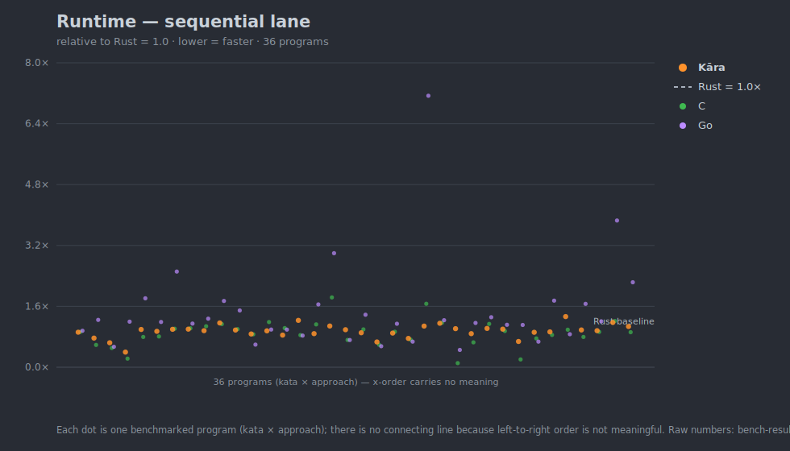
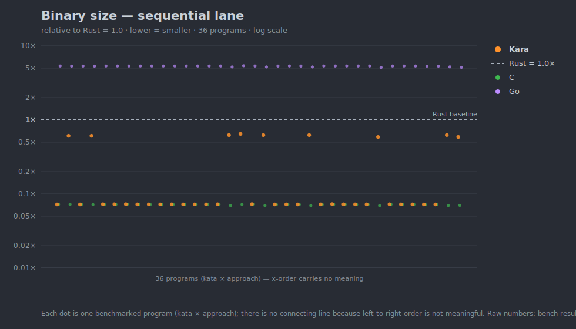

# Kāra

```
 compiling the compiler...
 [▓▓▓▓▓▓▓▓▓▓▓▓▒▒░░░░░░░░░░░░]
```

Kāra is a systems programming language for the age of AI-written code. Declare intent; the compiler handles what LLMs get wrong — memory layout, ownership, concurrency — and emits every decision as structured output agents can consume.

Questions, ideas, or design feedback? [Start a GitHub Discussion](https://github.com/karalang/kara/discussions/new/choose) — all input welcome.

---

## Hello, Kāra

```kara
fn main() {
    println("Hello, world!");
}
```

```bash
karac run hello.kara        # Hello, world!
```

Three things Kāra does that other languages make you do by hand:

- **Effects → automatic concurrency.** Functions declare what they touch; the compiler runs independent work in parallel for you — no `async`/`await`, no colored functions, no thread plumbing.
- **Ownership without lifetime annotations.** Memory safety with no `'a` syntax — parameter modes are declared at the signature; the rest is inferred.
- **Every compiler decision as JSON.** Effects, ownership, concurrency, and fixes are all queryable, so agents (and you) read exactly what the compiler decided.

### The whole idea in one program

Reads from two data sources and combines them — written as plain sequential code. The compiler proves the two reads are independent and runs them concurrently, and it borrows its inputs with no lifetime annotations:

```kara
// Two distinct data sources, both backed by one trait.
trait Source {
    fn load(ref self) -> Vec[i64];
}
effect resource UserDB: Source;
effect resource OrderDB: Source;

// Private functions — the compiler infers each one's effects from its body:
//   fetch_users  -> reads(UserDB)
//   fetch_orders -> reads(OrderDB)
fn fetch_users() -> Vec[i64]  { UserDB.load() }
fn fetch_orders() -> Vec[i64] { OrderDB.load() }

// `ref` borrows its inputs — no copy, and no lifetime annotation.
fn total(users: ref Vec[i64], orders: ref Vec[i64]) -> i64 {
    users.len() as i64 + orders.len() as i64
}

fn main() {
    // Two reads on two different resources: no shared data, no conflict.
    // The compiler proves them independent and runs them concurrently —
    // no async, no threads, no annotation.
    let users  = fetch_users();      // statement 0
    let orders = fetch_orders();     // statement 1

    // Both results are first used here, so the compiler inserts the join.
    println(total(users, orders));   // statement 2 — waits on 0 and 1
}
```

Don't take the concurrency on faith — ask the compiler what it did:

```bash
$ karac query concurrency app.kara.main
{"function":"main","total_statements":3,
 "parallel_groups":[{"statements":[0,1],"reason":"independent reads on different resources"}]}
```

The two fetches run in parallel, and the compiler tells you *why* — there is no `par`, no `async`, and no thread code anywhere in the source. Everything below is the detail behind these three ideas.

---

## What Makes Kāra Different

### AI-First Compiler Interface

The compiler's analyses aren't trapped in human-oriented text — every decision it makes is queryable as JSON.

**Query API.** `karac query <kind> <file>[.<function>]` exposes what the compiler inferred:

| Query | Returns |
|---|---|
| `effects` | inferred vs. declared effects, per function |
| `ownership` | parameter modes, RC fallbacks (with the trigger line), closure captures |
| `concurrency` | which statements auto-parallelize, and why |
| `cost-summary` | RC ops, Arc wraps, and perf notes per function or file |
| `monomorphization` | generic instantiation table — which types, at which sites |
| `affected-by` | transitive callers/callees/tests of a function or line range |
| `attributes` | index of namespaced `#[tool::*]` attributes |

Querying the `load_dashboard` example from the next section:

```bash
$ karac query concurrency dashboard.kara.load_dashboard
{"function":"load_dashboard","total_statements":3,
 "parallel_groups":[{"statements":[0,1,2],"reason":"no data or effect dependencies"}]}
```

**Structured diagnostics with machine-applicable fixes — the loop, end to end.** `karac check|build|run --output=json` emits diagnostics with phase, error code, span, and — where the compiler knows the answer — the fix as concrete edits. `karac fix` applies them. Here is the whole agent loop on a real mistake: an LLM writes a config resource whose trait method consumes its receiver (`self`) while promising a reads-only contract —

```
pub effect resource Cfg: Config;
pub trait Config { fn get(self, key: i64) -> i64 with reads(Cfg); }

fn limits() -> i64 with reads(Cfg) {
    let lo = Cfg.get(1);
    let hi = Cfg.get(2);
    lo + hi
}
```

An owned `self` receiver means every `Cfg.get(...)` call infers `writes(Cfg)` — the declared `reads(Cfg)` can never hold, and the two lookups in `limits` serialize as write-write conflicts. The compiler flags the root cause at the trait definition, with the fix as a byte-precise edit:

```bash
$ karac check config.kara --output=json
{"diagnostics":[{"code":"E0412","phase":"effect","line":2,"column":27,
  "message":"trait method 'Config.get' declares reads(Cfg) but its `self` receiver
    makes every 'Cfg.get' call infer writes(Cfg); change the receiver to `ref self`
    or declare writes(Cfg)",
  "replacement":{"offset":59,"length":4,"text":"ref self"}}]}

$ karac fix config.kara
applied 1 fix(es) to config.kara

$ karac check config.kara --output=json
{"diagnostics":[]}

$ karac query concurrency config.kara.limits
{"function":"limits","total_statements":2,
 "parallel_groups":[{"statements":[0,1],"reason":"concurrent reads on same resource"}]}
```

No prose was parsed anywhere in that loop. And the fix didn't just silence an error — with the receiver corrected to `ref self`, the two config reads now run concurrently.

`--output=jsonl` streams build events (`phase_start`, `diagnostic`, `build_complete`, …) so agents can react before the build finishes.

**Explanations on demand.** `karac explain --class=TYPE_MISMATCH` (or `--concept=<name>`) returns the spec-grounded explanation behind any diagnostic class, as text or JSON.

**Canonical source form.** `karac fmt` emits one canonical formatting, so agent-written diffs stay semantic. `karac catalog` emits one JSONL signature record per function/type for cheap codebase indexing.

### Effect System — No Async/Await, No Colored Functions

Every function declares what it does to the world. The compiler uses this for automatic parallelization:

```
pub effect resource UserDB: UserDatabase;
pub effect resource OrderDB: OrderDatabase;
pub effect resource NotifDB: NotificationDatabase;

fn load_dashboard(user_id: i64) -> Dashboard
    with reads(UserDB) reads(OrderDB) reads(NotifDB)
{
    let profile = fetch_profile(user_id);       // reads(UserDB)
    let orders = fetch_orders(user_id);         // reads(OrderDB)
    let notifications = fetch_notifs(user_id);  // reads(NotifDB)

    // Compiler sees non-conflicting effects → runs all three concurrently
    // Data dependency on all three → inserts sync point here
    build_dashboard(profile, orders, notifications)
}
```

No `async fn`. No colored functions. No `Promise.all`. The compiler handles concurrency because it understands effects and data dependencies.

And it's **deterministic by contract**: the same source + compiler + target always yields the same parallelization, and any two operations the analysis can't prove independent keep their source-order, user-visible effects. So auto-parallelism never makes output order a coin flip — what runs concurrently is decided at compile time, not by the scheduler. ([Determinism contract](docs/design.md).)

### Tiered Ownership — No Lifetime Annotations

Modes are declared at the signature — bare `T` is owned, `ref T` / `mut ref T`
are explicit borrows. There are no lifetime parameters (`'a`); the compiler
infers where a returned borrow comes from by **source pinning**.

```
struct User { name: String, age: i64 }

// Returning a borrow: the compiler infers it borrows from `u` — no `'a`.
fn name_of(u: ref User) -> ref String { u.name }

// The canonical accessor (`ref self`).
impl User {
    fn name(ref self) -> ref String { self.name }
}

// Two ref params: the return is inferred to borrow from *both* (and may
// outlive neither). Still no annotation — Rust needs `<'a>` here.
fn longer(a: ref String, b: ref String) -> ref String {
    if a.len() > b.len() { a } else { b }
}
```

**What replaces lifetime parameters** is the source-pinning rule: every
returned `ref` must trace to a `ref` parameter — one ref parameter → inferred,
several → the conservative union of all. Borrowing past the source's lifetime
is a compile error, caught statically, not at runtime:

```
// fn bad(u: User) -> ref String { u.name }   — u is owned, dropped at return
error[ownership]: returned borrow does not originate from a `ref` parameter;
  its source is dropped when the function returns, leaving a dangling
  reference   [E0509]

// let n = name_of(u); consume(u);   — moving u while n still borrows it
error[ownership]: cannot move `u` while a borrow into it (a returned
  reference still points at it) is still live
```

That second diagnostic is the no-`'a` equivalent of Rust's "cannot move out
of `u` because it is borrowed" — reached through ownership + borrow analysis,
with no lifetime syntax in the source. The compiler also shows what it
inferred (every analysis is queryable as JSON, like the effects above):

```
$ karac query ownership user.kara.name_of
{"function":"name_of","parameters":[{"name":"u","mode":"ref","representation":"ref (borrow)"}],"rc_values":[],"closures":[]}
```

**Why this is safe.** Source pinning is deliberately *conservative*. A returned
`ref` must trace to a `ref` parameter; when several qualify, the compiler unions
them, so the result is bounded by its shortest-lived source. That means Kāra can
*reject* a program a finer analysis would accept — but it can never *accept* one
that dangles. When it can't prove a borrow outlives its use, it doesn't guess: it
escalates to RC and tells you. The safety comes from refusing to guess, not from
out-thinking the aliasing problem.

Escalation path: owned → `ref` → RC. Reference counting is inserted only when
a value's use-sites can't be ordered by control flow — and every insertion
emits a note, never a silent surprise. Full model:
**[design.md § Feature 4](docs/design.md)**.

### Data Layout Separation

Logical structure stays clean. Physical layout is a separate, opt-in concern:

```
struct Entity {
    id: u64, name: String,
    position: Vec3, velocity: Vec3,
    health: f32, armor: f32, is_alive: bool,
}

layout entities: Collection<Entity> {
    group physics { position, velocity }   // hot path: physics tick
    group combat { health, armor, is_alive } // hot path: combat
    group metadata { id, name }              // cold
}
```

## Production Readiness

What v1 ships with, what the numbers look like, and what the toolchain gives you.

### Concurrency Runtime

**2M idle WebSocket-over-TLS connections in one process. ~12.1 KB/connection — 2.3× denser than Rust. Reproducible.**

Measured on an r8g.4xlarge (16 vCPU), 0 failures, with the per-connection handler executing — not a target. The densest of seven runtimes benchmarked here (vs Rust, Java/Netty, Node, Go, .NET, Phoenix). Methodology, cost model, and caveats: **[REPORT.md](examples/ws_idle_holder/bench/REPORT.md)** · [reproduction harness](examples/ws_idle_holder/bench).

The numbers behind each claim:

- Blocking-style I/O syntax; effect-driven scheduling moves blocking work off the par-runtime threads.
- **Demo 1 verified on r8g.4xlarge (Linux, 16 vCPU) at 1M and 2M, head-to-head with a Rust (tokio + rustls) reference on the same box** — with the per-connection handler **executing** (recv/send over the coroutine network-async transform; the recv buffer + coroutine frame are held, not freed): both impls hold **2 000 000 idle WebSocket-over-TLS connections, 0 failures**. **Kāra at ~12.1 KB/conn** server-side RSS vs **Rust at ~27.9 KB/conn** — **2.30× runtime-density advantage**, scale-invariant 1M↔2M (Kāra −0.03 % drift). In production-cost terms, counting the kernel socket buffer both stacks pay equally, total server-side memory is **15.0 KB vs 30.4 KB/conn (2.03×)** — so at a realistic 250K conns/box Kāra fits an 8 GiB `m7g.large` where Rust needs a 16 GiB `m7g.xlarge`, ≈**50 % lower infra cost** (~$473 vs ~$946/yr per 250K unit on a 1-yr reserved instance). Connect-phase latency at `--concurrency 64` (1M): Kāra **mean 82 ms, p50 46 ms, p99 255 ms**; Rust keeps a ~3 ms p50 (tighter handshake hop) but a wider tail. Source: [`examples/ws_idle_holder`](examples/ws_idle_holder); full methodology + cost model + caveats in [`examples/ws_idle_holder/bench/REPORT.md`](examples/ws_idle_holder/bench/REPORT.md); reproduction harness in [`examples/ws_idle_holder/bench`](examples/ws_idle_holder/bench). _Note: an earlier 7.8 KB/conn / 3.55× figure was measured before the handler executed and is superseded._
- **Benchmarked against five commercial WebSocket stacks** at 250K idle conns/box (same harness as the Rust reference, in-process TLS, apples-to-apples). Per-connection server RSS, densest first: **Kāra 12.1 KB** · Java/Netty 14.4 KB\* · Rust 27.9 KB · Node.js 40.4 KB · Go 43.4 KB · .NET/Kestrel (Linux) 52.9 KB · Phoenix Channels 102.8 KB — **the densest runtime in this set**: **3.4× lighter than Node, 3.7× than Go, 4.5× than .NET, 8.7× than Phoenix**. _\*Netty's RSS is a JVM `-Xmx` dial: 14.4 KB is its balanced-heap deployment point (marginal slope ~12.8 KB, live set ~8–10 KB); every other stack here, Kāra included, reports a fixed live footprint._ Per-comparator tables, GC-dial analysis, and the per-runtime cost reframes are in [`examples/ws_idle_holder/bench/REPORT.md`](examples/ws_idle_holder/bench/REPORT.md).

### Standard Library at v1

In-tree, no third-party runtime dependencies. Blocking-style I/O, no
function coloring — the effect-driven scheduler moves blocking work off
the par-runtime threads. Minimal, compiling examples live in
[`examples/std_net`](examples/std_net).

- **HTTP/1.1 server** — [`runtime/stdlib/http.kara`](runtime/stdlib/http.kara) · `Server.serve(addr, handler)` over `Fn(Request) -> Response` · [minimal example](examples/std_net/http_hello.kara)
- **TLS** — [`runtime/stdlib/tls.kara`](runtime/stdlib/tls.kara) · `Server.serve_tls(addr, cert, key, handler)`; `TlsListener` / `TlsStream` for raw sockets · [minimal example](examples/std_net/https_hello.kara)
- **WebSocket** — [`runtime/stdlib/ws.kara`](runtime/stdlib/ws.kara) · `WebSocket.accept` / `accept_tls`, `recv_text` / `send_text` · [minimal example](examples/std_net/ws_echo.kara)

The same surface, at scale: [`examples/ws_idle_holder`](examples/ws_idle_holder)
holds 2M idle WebSocket-over-TLS connections (see Concurrency Runtime above).

### Performance

Cross-language benchmarks vs. Rust (`rustc -O`), C (`clang -O3`), and Go
(`go build`) live in the **[kara-katas](https://github.com/karalang/kara-katas)**
repo — one corpus of algorithm kernels, each in multiple languages, with
the data feed and chart generator versioned alongside the code. Full
chart set and methodology: **[BENCHMARKS.md](https://github.com/karalang/kara-katas/blob/main/BENCHMARKS.md)**;
raw numbers: **[bench-results.json](https://github.com/karalang/kara-katas/blob/main/bench-results.json)**.

These benchmarks are validation, not a value proposition: the bar is
**parity** — that Kāra's safety, ownership, and effect abstractions land
production-class workloads within a few percent of Rust/C, with no
performance cliff. The corpus is also a correctness exercise — 30+
algorithm kernels spanning control flow, generics, collections, pattern
matching, ownership, and codegen, where small programs surface a
disproportionate share of compiler bugs.

**Sequential lane** (`KARAC_AUTO_PAR=0`) — the headline, apples-to-apples
against single-threaded Rust/C/Go. Each dot is one program; lower is
faster; everything relative to **Rust = 1.0**.



Kāra tracks C closely and straddles the Rust baseline — ahead on
allocation/RC- and string-heavy kernels, behind on a few tight numeric
loops. Go trails on most single-threaded work.



C-sized binaries (~33 KiB) for most programs, rising to a ~285 KiB floor
when the larger runtime surface links. Rust ~14× above C; Go ~70×
(runtime + GC in every binary).

- **Runtime memory** ([chart](https://github.com/karalang/kara-katas/blob/main/graphs/rss-seq.svg)) — Kāra/C/Rust at parity; Kāra runs leak-free at native footprint. Go's GC heap is 2–8×.
- **Compile cost** ([time](https://github.com/karalang/kara-katas/blob/main/graphs/compile-elapsed.svg) · [memory](https://github.com/karalang/kara-katas/blob/main/graphs/compile-rss.svg)) — faster than `rustc -O` on every program (~0.55–0.8×) and ~0.3× its peak memory.

<sub>The two charts above are mirrored from kara-katas into [`docs/assets/`](docs/assets) (GitHub doesn't reliably render hotlinked external SVGs). After adding a kata, regenerate them in kara-katas (`python3 scripts/bench-graph.py`) and refresh with [`scripts/sync-bench-charts.sh`](scripts/sync-bench-charts.sh).</sub>

**Auto-parallel lane** (default runtime, reported separately) — Kāra's
compiler auto-parallelizes dependency-free reductions/maps with no
`rayon`, no goroutines, no thread plumbing, and no data-race risk
([chart](https://github.com/karalang/kara-katas/blob/main/graphs/autopar-speedup.svg)).
This is *intra-Kāra* (same source, auto-par vs sequential): **3.7×** on a
~100 ns kernel up to **13.4×** on a heavier one, against an 18-core
ceiling. It applies to data-parallel work over large datasets — not
I/O-bound, tiny, or sequentially-dependent loops, where the compiler's
cost gate declines to parallelize. A full cross-language parallel lane
(Kāra auto-par vs Rust `rayon` vs Go goroutines) lands as more parallel
katas do.

### Toolchain

- LLVM-backed codegen.
- Address-sanitizer–clean across the codegen E2E suite.
- Structured diagnostics and the AI-first compiler interface described above.

### Targets

- **Native** — the v1 compile target.
- **WASM** (`wasm32-wasip1`) — single-file compute builds work today: `karac build x.kara --target=wasm_wasi` emits a `.wasm` that runs under any WASI host (arith, `Vec`, `Option`, `String`, `Map`, JSON, structs/enums/`match`, recursion, file I/O via WASI preopens — byte-identical to native). Verified end-to-end under `node:wasi`; see [`examples/wasm_hello`](examples/wasm_hello). **Compute-only for now** — no networking or auto-parallelism on WASM yet (the wasm runtime archive is built without the tokio/scheduler surface), and project-mode/browser builds are in progress. Scope: [docs/implementation_checklist/phase-10-targets.md](docs/implementation_checklist/phase-10-targets.md).
- **GPU and embedded** — on the roadmap (Phase 10); one language across targets under per-target profile constraints. GPU ships as a compile target first; call-site ergonomics come later. See [docs/design.md](docs/design.md).

## Docs

- **[docs/design.md](docs/design.md)** — The language specification. Authoritative source for all committed design decisions.
- **[docs/syntax.md](docs/syntax.md)** — Syntax reference and quick lookup.
- **[docs/glossary.md](docs/glossary.md)** — Terminology used across the design and compiler.
- **[docs/roadmap.md](docs/roadmap.md)** — Compiler implementation plan, phase by phase.
- **[docs/implementation_checklist/](docs/implementation_checklist/)** — Items to validate, benchmark, or revisit during specific phases.
- **[docs/deferred.md](docs/deferred.md)** — Committed designs for deferred features (P1: decided/non-breaking, P2: speculative).
- **[docs/dogfooding.md](docs/dogfooding.md)** — The V1 dogfooding roster: real programs built in Kāra that surface bugs, harden the language, and prove its differentiating features.

## Project Status

Actively developed, pre-1.0. The frontend, interpreter, query API, auto-concurrency runtime, and LLVM codegen are in place; the standard library is being filled in. End-to-end compilation works for a growing subset of the language. See [docs/roadmap.md](docs/roadmap.md) for the current phase breakdown.

We took a **tree-walk interpreter first** approach: language semantics were validated with an interpreter before LLVM code generation.

## Prior Art

| Language/System | What Kāra takes |
|---|---|
| **Rust** | Ownership, enums, pattern matching, traits, `Result<T,E>` |
| **Koka** | Algebraic effect system (simplified: no handlers, trait injection instead) |
| **Zig** | Memory layout control, comptime (deferred) |
| **Go** | Simple concurrency model (blocking I/O on threads) |
| **Swift** | Inferred reference counting (as fallback, not primary) |
| **Unity DOTS / Bevy** | Data-oriented design, SoA layouts |

## Getting Started

```bash
cargo build                          # build the compiler (no LLVM backend)
cargo test                           # run the front-end tests (lexer, parser, resolver, typechecker, effect, ownership, interpreter)
cargo test --features llvm           # also run codegen E2E and memory-sanitizer tests
cargo clippy --all --all-targets -- -D warnings   # lint
cargo fmt                            # format
```

Codegen E2E tests (`tests/codegen.rs`, `tests/par_codegen.rs`, `tests/memory_sanitizer.rs`) are gated on `--features llvm` and need the runtime library built once via `cargo build -p karac-runtime --release`. The memory-sanitizer suite additionally needs a `cc` toolchain that supports `-fsanitize=address`; it skips gracefully on hosts that don't.

See [docs/roadmap.md](docs/roadmap.md) for current progress and [docs/design.md](docs/design.md) for the language specification.

## Why I Built Kāra

Allow me to share some words before we go all technical. Before AI happened i used spend most of my time learning new proramming language/features. Coding feels like solving puzzles for me. Once AI happened I was kinda cluelsess for sometime. I thought of taking some time off and learn real spoken languages. While doing the research I started noticing the strengths and weakness of different languages because they were all organically developed over centuries. What if i can engineer a new language learning from all the issues and weakness. Evnetually i strted translating that in to a programming language and that's how Kara was born. Kara in sanskrit means worker. You express your intent and worker does the work. I am an artist and i consider this one of my finest art yet.

I see some skepticism on the AI usage everywhere, I think this is going to be new normal or this already is. We need to find a balance between passion and building usable product within reasonable time to market. Kara fits right in.

I have over 70 brainstorming docs with 1000's of lines of details and choices documented. Written by ai but i read each line of it and made the decision. I enjoyed engienering the syntax that i like. A language I would want to use and at the same time meaningful for the AI era. 

There could be some spelling and grammer mistakes in the narration and I left it unpolished. mistakes is what makes us humans. 

AI was my assistent, not the language author

## License

Licensed under either of

- Apache License, Version 2.0 ([LICENSE-APACHE](LICENSE-APACHE) or <http://www.apache.org/licenses/LICENSE-2.0>)
- MIT license ([LICENSE-MIT](LICENSE-MIT) or <http://opensource.org/licenses/MIT>)

at your option.

### Contribution

Unless you explicitly state otherwise, any contribution intentionally submitted for inclusion in the work by you, as defined in the Apache-2.0 license, shall be dual licensed as above, without any additional terms or conditions.
